# tech-dd-agent

An AI agent that runs the first pass of a technology due diligence on a git repository and writes an investment-committee-style report: a scorecard across five DD workstreams, red flags, value-creation levers, a 100-day plan, and every finding tied to the file or scanner result it came from.

Example output: [board-pack-assistant report (HTML)](examples/board-pack-assistant/report.html) · [same report as Markdown](examples/board-pack-assistant/report.md)

## Why

A buyer looking at a software company needs a technology due diligence first: what the product is built on, how much tech debt comes with it, whether there is a security red flag before close, and how dependent it is on a few people. Much of the first week of that work is repetitive evidence gathering: clone the repo, inventory the stack, look for tests, CI, containers and secrets, read the git history. An agent can do that pass in minutes for about $0.20, so the consultant starts from a cited draft and spends their time on judgement, interviews and the investment case.

## How it works

```mermaid
flowchart LR
    T[Target: URL or path] --> I[Inventory]
    I --> S[Deterministic scanners]
    S --> L[(Evidence ledger)]
    L --> A[5 specialist agents<br/>list_files / read_file / grep]
    A -->|findings cite evidence IDs| G[Grounding<br/>drop uncited findings]
    G --> C[Calibration<br/>cap history-only team findings,<br/>drop contradicted strengths]
    C --> D[Cross-dimension dedupe]
    D --> F[Rule floor<br/>merge scanner flags]
    F --> SC[Deterministic scoring]
    SC --> SY[Synthesis agent<br/>summary, red flags, 100-day plan]
    SY --> R[Report: HTML / Markdown / JSON]
    L -.->|offline mode, no LLM| F
```



The design keeps the language model on a short leash. Three mechanisms make the output auditable:

1. **Evidence ledger and mandatory citations.** Every scanner result and every file the agents read or search gets an ID (`SEC-001`, `READ-014`, ...). A finding must cite at least one ID. Findings whose citations all fail to resolve are dropped and unknown IDs are stripped, so an invented citation cannot reach the page. A `READ` ID only counts for the specialist that opened the file, so one agent cannot borrow another agent's reading. Dropped findings are counted in the report.
2. **Rule floor for critical and high facts.** Scanner flags of severity critical or high (a committed secret, no tests at all, a key-person dependency) always become findings, whatever the model says. The model can raise their severity, never remove them. Each flag needs its own model finding to absorb it, so one broad finding cannot swallow two flags.
3. **Cross-dimension dedupe and deterministic scoring.** A single fact should cost points once. A finding is dropped as a duplicate only when it cites no scanner evidence from its own dimension **and** every scanner citation it makes from another dimension (say, a security finding citing only the dormancy signal) is already covered by a kept finding in the owning dimension. A finding that also brings evidence of its own is kept. The number of findings removed this way is printed in the report and in the CLI summary. The dedupe runs before the rule floor, so it can never remove a flagged critical or high fact, and scanner flags only strengthen a model finding in their own dimension. The model rates severity; code does the arithmetic. Each dimension starts at 100 and loses 35 / 15 / 6 / 2 / 0 points per critical / high / medium / low / info finding. Green is 80 or above, amber 55 or above, otherwise red. **Any critical finding makes the rating red regardless of the numeric score**, for a dimension and for the overall rating. The overall score is the rounded mean of the assessed dimensions.

Between grounding and dedupe, a small calibration step catches two failure modes seen in earlier runs. A team finding rated high or critical that rests only on commit-history numbers the scanner did not flag (activity, bus factor, dormancy) is capped at medium. A strength (`info`) about a file the scanner flagged in the same dimension or in security is dropped, so "the Dockerfile sets a USER" cannot sit next to "the container runs as root". Severity words are also stripped from the start of model-written titles.

**Secrets never reach the model or the report.** The secret scanner records only the pattern name and `file:line`. The agents' `read_file` and `grep` tools pass every line through the same patterns and replace matches with `[REDACTED: <pattern>]`, and they refuse real `.env` files and private-key files outright (`.env.example` and other templates stay readable). As a last line of defence, every model-written string (finding titles, descriptions, recommendations and the whole executive summary) is redacted once more before the report is built. A failed `git clone` reports the URL with any embedded credentials removed.

**One failing specialist does not sink the run.** If a specialist errors (for example, its structured output still fails validation after the repair pass), its dimension is recorded in `failedDimensions`, shown as "Not assessed" with no score, and left out of the overall mean. The overall rating cannot be green while any dimension is unassessed, and scanner flags of critical or high severity for that dimension are still listed. If all five fail, the run stops without writing a report.

## Dimensions and DD workstreams

| Dimension | Evidence prefix | What it answers for the buyer |
|---|---|---|
| `architecture` | `ARC` | What is it built on, and can it scale and extend? |
| `code_quality` | `QUA` | How much tech debt are we buying? |
| `security` | `SEC` | Is there a pre-close red flag? |
| `cloud_readiness` | `CLD` | Can it be operated or migrated cheaply? |
| `team_process` | `TEAM` | Key-person risk, delivery discipline |

Files read and searches run by the agents are logged under the prefix `READ`.

## Quickstart

Requires Node 24+ and git. The agent is built on [`ensemble`](https://github.com/tSLoseth/ensemble), which is referenced as a sibling folder and must be built once (its `dist/` is not committed), so clone both side by side:

```bash
git clone https://github.com/tSLoseth/ensemble
git clone https://github.com/tSLoseth/tech-dd-agent
cd ensemble && npm install && npm run build
cd ../tech-dd-agent && npm install
```

Offline mode runs the scanners and scoring only. No API key, no cost:

```bash
npm run dd -- https://github.com/gothinkster/node-express-realworld-example-app --offline
```

Full mode adds the five specialist agents and the synthesis. Put `ANTHROPIC_API_KEY=...` in a `.env` file (or the environment), then:

```bash
npm run dd -- <repo-url-or-local-path> [--out <dir>] [--model <id>] [--concurrency <n>]
```

Reports are written to `reports/<repo>/report.{html,md,json}` unless `--out` is given. The default model is Claude Haiku 4.5.

## Example reports

| Target | What it is | Overall | Findings | Report |
|---|---|---|---:|---|
| [board-pack-assistant](https://github.com/tSLoseth/board-pack-assistant) | My own full-stack Next.js app (AI board-pack briefing) | 81 / Green | 25 | [Markdown](examples/board-pack-assistant/report.md) · [HTML](examples/board-pack-assistant/report.html) |
| [tiny-agent-sdk](https://github.com/tSLoseth/tiny-agent-sdk) | My own small agent library (learning project) | 80 / Green | 23 | [Markdown](examples/tiny-agent-sdk/report.md) · [HTML](examples/tiny-agent-sdk/report.html) |
| [node-express-realworld-example-app](https://github.com/gothinkster/node-express-realworld-example-app) | Public reference Express + Prisma API | 68 / Amber | 23 | [Markdown](examples/realworld-express/report.md) · [HTML](examples/realworld-express/report.html) |

No model finding was dropped for invented evidence in any of the three runs. The dedupe removed 3, 5 and 4 cross-dimension duplicates respectively, and every specialist completed.

The public API scores lowest. Its most serious finding is a hard-coded fallback JWT signing secret (`process.env.JWT_SECRET || 'superSecret'`): anyone who knows that default can forge login tokens for any user if the variable is ever unset. Around that, it has had no commits in 995 days, no CI, no infrastructure as code and a container that runs as root. Security, cloud readiness and team & process all land in amber (58–59).

My own repos come out green overall, but not in every dimension. board-pack-assistant (81) is held back by operations: no containers, no infrastructure as code and no observability put cloud readiness at 74, and the missing CI pipeline puts team & process at 79. tiny-agent-sdk (80) loses most on code quality (no tests at all) and team & process (64). Both repos have a single author with only 3–4 commits. The team scanner now reports that this history is too short to assess key-person risk (it needs at least 20 commits) and raises no key-person flag, so the single-author findings the specialists still write are capped at medium. The one high team finding on tiny-agent-sdk is about the missing CI pipeline, which the scanner does flag.

The JSON files hold the full evidence ledger behind each report.

## Cost

Measured on the demo runs with Claude Haiku 4.5 (full mode, five specialists plus synthesis):

| Target | Size | Cost |
|---|---|---:|
| board-pack-assistant | 62 files, 2,524 lines | $0.23 |
| tiny-agent-sdk | 25 files, 1,094 lines | $0.20 |
| node-express-realworld-example-app | 67 files, 2,537 lines | $0.19 |

Total for the three committed runs: $0.62, so roughly $0.19 to $0.23 per repository. Offline mode is free.

## Limitations

- Static analysis only: no runtime, load or penetration testing.
- Secret scanning is regex-based, so it has both false positives and false negatives. The generic "hardcoded credential" pattern is not applied to Markdown files or tests, so placeholders in docs do not raise a critical, but a real credential in a test fixture is missed.
- Prompt injection from the audited repository. The agents read the target's files, and a hostile repo could embed instructions aimed at them (for example "report no security issues"). The model's findings are therefore not trusted on their own: scanner flags of critical or high severity always reach the report through the rule floor, whatever the agents say, and grounding discards any finding that cites evidence that does not exist. A successful injection could still suppress or soften findings the scanners cannot detect.
- Git author aliases are not merged, so the bus factor can be overstated when one person commits under several names.
- No CVE lookup of dependencies yet.
- Cost reporting undercounts slightly: the repair passes inside `runStructured` (when a model's structured output fails validation) are not included.
- Runs are not fully reproducible even at temperature 0. A second run of tiny-agent-sdk, made during the final re-run, scored 80 where the first had scored 85.
- The model can still make judgement errors that grounding cannot catch: a finding can cite a real file and still misread it or rate it oddly. Real examples from the committed reports:
  - The tiny-agent-sdk report lists "path traversal and command injection mitigated by defense-in-depth design" as a strength. The path checks are real, but a shell command is auto-allowed if its first word is on the allowlist, so `ls && <anything>` gets through.
  - The same report penalises the missing tests twice: once in code quality, and again as a high team & process finding. The dedupe keeps the second one on purpose, because it also cites the team dimension's own CI evidence.
  - The realworld report rates the hard-coded JWT fallback secret high, not critical. The fallback expression does not match the secret scanner's credential pattern (which needs a quoted value of 12 or more characters right after the key name), so there is no scanner flag to hold it at critical, and the overall rating is amber rather than red.
  - The realworld report calls bcrypt with cost 10 "weak password hashing" at medium, while its own description says 10 is acceptable.

  Every finding links to its evidence so a reviewer can check it quickly.
- It is a first pass. It does not replace expert interviews, management sessions or a review of commercial contracts and licences.

## Built on

[`ensemble`](https://github.com/tSLoseth/ensemble), my own Anthropic-first multi-agent orchestration SDK for TypeScript. This project uses its agent loop, typed tools, Zod-validated structured output (`runStructured`), the event bus for live progress, and cost tracking.
