# tech-dd-agent

An AI agent that runs the first pass of a technology due diligence on a git repository and writes an investment-committee-style report: a scorecard across five DD workstreams, red flags, value-creation levers, a 100-day plan, and every finding tied to the file or scanner result it came from.

Example output: [board-pack-assistant report (HTML)](examples/board-pack-assistant/report.html) · [same report as Markdown](examples/board-pack-assistant/report.md)

## Why

A buyer looking at a software company needs a technology due diligence first: what the product is built on, how much tech debt comes with it, whether there is a security red flag before close, and how dependent it is on a few people. Much of the first week of that work is repetitive evidence gathering: clone the repo, inventory the stack, look for tests, CI, containers and secrets, read the git history. An agent can do that pass in minutes for about $0.20, so the consultant starts from a cited draft and spends their time on judgement, interviews and the investment case.

## How it works

```mermaid
flowchart LR
    T[Target: URL or path] --> I[Inventory]
    I --> S[Deterministic scanners]
    S --> L[(Evidence ledger)]
    L --> A[5 specialist agents<br/>list_files / read_file / grep]
    A -->|findings cite evidence IDs| G[Grounding<br/>drop uncited findings]
    G --> D[Cross-dimension dedupe]
    D --> F[Rule floor<br/>merge scanner flags]
    F --> SC[Deterministic scoring]
    SC --> SY[Synthesis agent<br/>summary, red flags, 100-day plan]
    SY --> R[Report: HTML / Markdown / JSON]
    L -.->|offline mode, no LLM| F
```



The design keeps the language model on a short leash. Three mechanisms make the output auditable:

1. **Evidence ledger and mandatory citations.** Every scanner result and every file the agents read or search gets an ID (`SEC-001`, `READ-014`, ...). A finding must cite at least one ID. Findings whose citations all fail to resolve are dropped and unknown IDs are stripped, so an invented citation cannot reach the page. Dropped findings are counted in the report.
2. **Rule floor for critical and high facts.** Scanner flags of severity critical or high (a committed secret, no tests at all, a key-person dependency) always become findings, whatever the model says. The model can raise their severity, never remove them.
3. **Cross-dimension dedupe and deterministic scoring.** A single fact should cost points once. If a finding cites scanner evidence owned by another dimension (say, a security finding citing the dormancy signal) and that dimension already has a finding on the same evidence, the off-lane finding is dropped. The dedupe runs before the rule floor, so it can never remove a flagged critical or high fact, and scanner flags only strengthen a model finding in their own dimension. The model rates severity; code does the arithmetic. Each dimension starts at 100 and loses 35 / 15 / 6 / 2 / 0 points per critical / high / medium / low / info finding. Green is 80 or above, amber 55 or above, otherwise red. **Any critical finding makes the rating red regardless of the numeric score**, for a dimension and for the overall rating. The overall score is the rounded mean of the five dimensions.

## Dimensions and DD workstreams

| Dimension | Evidence prefix | What it answers for the buyer |
|---|---|---|
| `architecture` | `ARC` | What is it built on, and can it scale and extend? |
| `code_quality` | `QUA` | How much tech debt are we buying? |
| `security` | `SEC` | Is there a pre-close red flag? |
| `cloud_readiness` | `CLD` | Can it be operated or migrated cheaply? |
| `team_process` | `TEAM` | Key-person risk, delivery discipline |

Files read and searches run by the agents are logged under the prefix `READ`.

## Quickstart

Requires Node 24+ and git. The agent is built on [`ensemble`](https://github.com/tSLoseth/ensemble), which is referenced as a sibling folder and must be built once (its `dist/` is not committed), so clone both side by side:

```bash
git clone https://github.com/tSLoseth/ensemble
git clone https://github.com/tSLoseth/tech-dd-agent
cd ensemble && npm install && npm run build
cd ../tech-dd-agent && npm install
```

Offline mode runs the scanners and scoring only. No API key, no cost:

```bash
npm run dd -- https://github.com/gothinkster/node-express-realworld-example-app --offline
```

Full mode adds the five specialist agents and the synthesis. Put `ANTHROPIC_API_KEY=...` in a `.env` file (or the environment), then:

```bash
npm run dd -- <repo-url-or-local-path> [--out <dir>] [--model <id>]
```

Reports are written to `reports/<repo>/report.{html,md,json}` unless `--out` is given. The default model is Claude Haiku 4.5.

## Example reports

| Target | What it is | Overall | Findings | Report |
|---|---|---|---:|---|
| [board-pack-assistant](https://github.com/tSLoseth/board-pack-assistant) | My own full-stack Next.js app (AI board-pack briefing) | 72 / Amber | 23 | [Markdown](examples/board-pack-assistant/report.md) · [HTML](examples/board-pack-assistant/report.html) |
| [tiny-agent-sdk](https://github.com/tSLoseth/tiny-agent-sdk) | My own small agent library (learning project) | 83 / Green | 19 | [Markdown](examples/tiny-agent-sdk/report.md) · [HTML](examples/tiny-agent-sdk/report.html) |
| [node-express-realworld-example-app](https://github.com/gothinkster/node-express-realworld-example-app) | Public reference Express + Prisma API | 71 / Red | 21 | [Markdown](examples/realworld-express/report.md) · [HTML](examples/realworld-express/report.html) |

The public API shows why the critical rule exists. Its numeric score of 71 would be amber, but it is rated red because of one fact: a hard-coded fallback JWT signing secret (`process.env.JWT_SECRET || 'superSecret'`). Anyone who knows that default can forge login tokens for any user. Around that, it has had no commits in 995 days, and it has no CI and a container that runs as root.

My own repos come out amber and green. board-pack-assistant (72, amber) is held back by operations: no containers, no infrastructure as code and no observability, so cloud readiness scores 43. Both of my repos also carry a high key-person finding, because I wrote every commit.

The JSON files hold the full evidence ledger behind each report.

## Cost

Measured on the demo runs with Claude Haiku 4.5 (full mode, five specialists plus synthesis):

| Target | Size | Cost |
|---|---|---:|
| board-pack-assistant | 62 files, 2,524 lines | $0.21 |
| tiny-agent-sdk | 25 files, 1,094 lines | $0.17 |
| node-express-realworld-example-app | 67 files, 2,537 lines | $0.13 |

Total for the three committed runs: $0.52, so roughly $0.13 to $0.21 per repository. Offline mode is free.

## Limitations

- Static analysis only: no runtime, load or penetration testing.
- Secret scanning is regex-based, so it has both false positives and false negatives.
- Git author aliases are not merged, so the bus factor can be overstated when one person commits under several names.
- No CVE lookup of dependencies yet.
- Cost reporting undercounts slightly: the repair passes inside `runStructured` (when a model's structured output fails validation) are not included.
- The model can still make judgement errors that grounding cannot catch: a finding can cite a real file and still misread it. Two real examples from the committed reports:
  - The tiny-agent-sdk report lists "command injection defended in depth" as a strength. In fact, a shell command is auto-allowed if its first word is on the allowlist, so `ls && <anything>` gets through.
  - The realworld report credits the Dockerfile with a `USER` directive it does not have, which contradicts that report's own "container runs as root" finding.

  Every finding links to its evidence so a reviewer can check it quickly.
- It is a first pass. It does not replace expert interviews, management sessions or a review of commercial contracts and licences.

## Built on

[`ensemble`](https://github.com/tSLoseth/ensemble), my own Anthropic-first multi-agent orchestration SDK for TypeScript. This project uses its agent loop, typed tools, Zod-validated structured output (`runStructured`), the event bus for live progress, and cost tracking.
